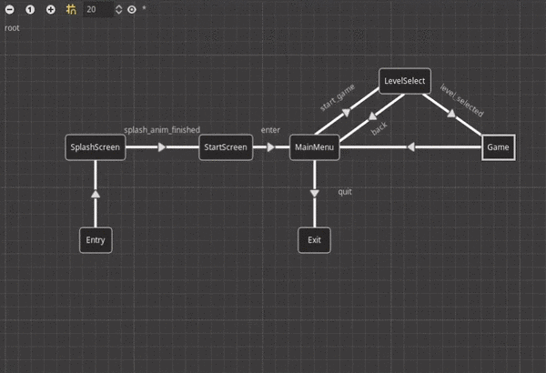

# Demo for [gd-YAFSM](https://github.com/imjp94/gd-YAFSM)

The purpose of this project is to showcase how you can integrate [gd-YAFSM](https://github.com/imjp94/gd-YAFSM) into your project.

## Content

- [Manage App State](#manage-app-state)
  - [Change Scene](#change-scene)
  - [Cache Scene](#cache-scene)
  - [Pause Game](#pause-game)
  - [Game State](#game-state)
- [Manage Character State](#manage-character-state)

## Manage App State

One of the best way to show the potential of `StateMachine`/[gd-YAFSM](https://github.com/imjp94/gd-YAFSM) is through managing app state as you can have full control over transitions of scenes.



### Change Scene

```gdscript
func _on_AppState_transited(from, to):
    ......
    # Handle previous scene
    var prev_scene
    if from_dir.is_nested():
        if from_dir.is_exit():
            prev_scene = get_node_or_null(from_dir.get_base())
    else:
        prev_scene = get_node_or_null(from)
    
    if prev_scene:
        prev_scene.queue_free()

    # Handle next scene
    var next_scene
    match to_dir.next():
        "SplashScreen":
            next_scene = splash_screen_scn.instance()
        "StartScreen":
            next_scene = start_screen_scn.instance()
        "MainMenu":
            next_scene = main_menu_scn.instance()
        "LevelSelect":
            next_scene = level_select_scn.instance()
        "Game":
            match to_dir.next(): # Match nested state
                "Entry": # Game/Entry
                    next_scene = game_scn.instance()
        "Exit":
            get_tree().quit()
    if next_scene:
        next_scene.name = to_dir.get_base()
        next_scene.set("app_state", app_state)
        add_child(next_scene)
```

*[Main.gd](Main.gd) free previous scene & spawn next scene in "transited(from, to)" signal*

### Cache Scene

Cache a unfinished game level, then restore it on next time

```gdscript
func _on_AppState_transited(from, to):
    ......
    match to_dir.next():
        "Game":
            match to_dir.next():
                "Exit": # Game/Exit
                    if not ("End" in from): # Not from Game/End(not finished)
                        remove_child(current_level_instance)
                        app_state.set_param("last_level", current_level_instance)
                        current_level_instance = null
    ......

func setup_level():
    if app_state:
        var last_level = app_state.get_param("last_level")
        ...
        current_level_instance = last_level
        ...
        if current_level_instance:
            current_level_instance.set("app_state", app_state)
            add_child(current_level_instance)
```

*[Game.gd](scenes/game/Game.gd) cache unfinished level with `StateMachinePlayer.set_param`, then retrieving from `StateMachinePlayer.get_param` to restore it*

> NOTE: Always remember to manually free `Node`, when erase from `StateMachinePlayer` to avoid memory leak

### Pause Game

Pausing game is just as easy as few line of codes:

```gdscript
func _on_AppState_transited(from, to):
    match to_dir.next():
        "Game":
            match to_dir.next():
                "Pause": # Game/Pause
                    if not pause_menu_instance:
                        pause_menu_instance = pause_menu_scn.instance()
                        pause_menu_instance.set("app_state", app_state)
                        ......
                    add_child(pause_menu_instance)
                    get_tree().paused = true
                "Play": # Game/Play
                    ......
                    get_tree().paused = false
                    if pause_menu_instance:
                        remove_child(pause_menu_instance) # Don't free yet, save for later
```

*[Game.gd](scenes/game/Game.gd) handle pause & resume*

### Game State

Most of the game has its own rules, like in what condition player win/lose, and this can be managed by `StateMachine` as well:

```gdscript
...
func _on_Area_body_entered(body):
    # Victory
    if body is Character3D:
        if app_state:
            app_state.set_param("Game/End/win", true)
            app_state.set_trigger("game_end")
...
```

[KinematicLevel3D.gd](scenes/game/3d/kinematicbody/KinematicLevel3D.gd) make use of nested parameter "Game/End/win" to update game state

> NOTE: Nested parameter("Game/End/win") is used in this case, so that it will be reset(erased) automatically on "Game/End/Exit" and you don't have to initiliaze the parameter everytime game start

## Manage Character State

```gdscript
func _on_StateMachinePlayer_updated(state, delta):
    # NOTE: It is more efficient to run directly in _physics_process, this demo is to showcase how to handle logic in updated signal
    velocity += Vector3.DOWN * 9.8 * delta
    match state:
        "Idle":
            pass
        "Walk":
            velocity += walk * speed * delta
            walk = Vector3.ZERO
        "Jump":
            _jump_count = 0
            jump()
            smp.set_param("jump_count", _jump_count)
        "Jump(n)":
            jump()
            smp.set_param("jump_count", _jump_count)
        "Fall":
            smp.set_param("jump_elapsed", OS.get_system_time_msecs() - _last_jump)
    velocity = move_and_slide(velocity, Vector3.UP)
    velocity.x *= pow(1.0 - damping, delta)
    velocity.z *= pow(1.0 - damping, delta)
```

*[Character3D.gd](scenes/game/3d/kinematicbody/Character3D.gd) update motion of KinematicBody*

> Note: `StateMachine` as a `Resource` only store static data, therefore it is highly reusable. For instance, both Character2D/3D are using the same `StateMachine` resource to control motion despite they inherit from different class
